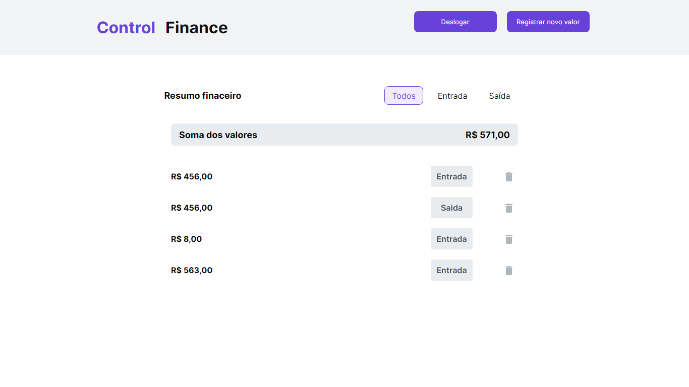
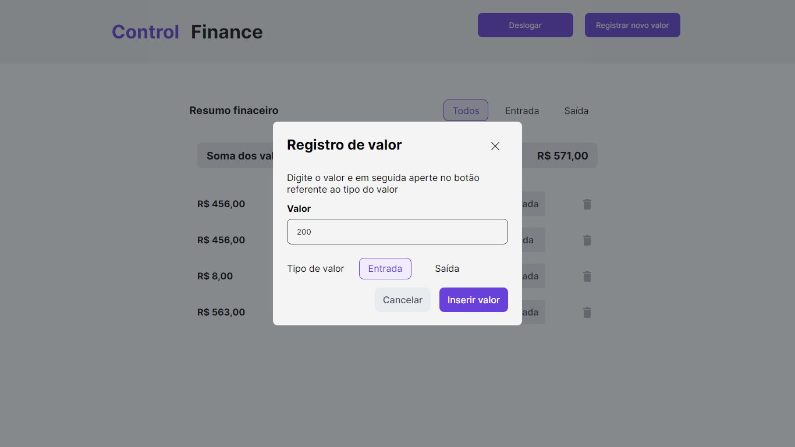
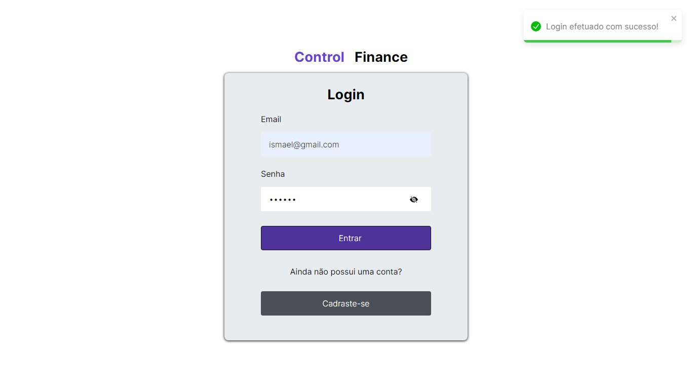
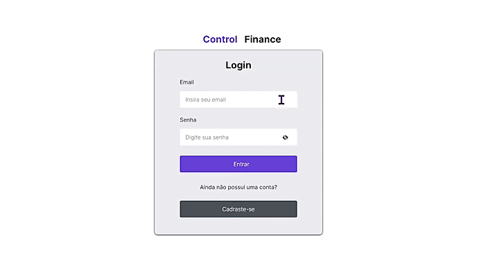

<p align="center">
  
</p>

## <p align="center">Control Finance</p>

<p align="center">
   
   
</p>

Control Finance tem como objetivo ajudar ao usuário a fazer uma melhor organização ao seu dinheiro.

## 📸 Screenshots
<p align="center">
  
  
  
</p>

## 🎥 Preview

<p align="center">
  
</p>

## 🚀 Rodando localmente

Clone o projeto

```bash
  git clone https://github.com/ismael-henrique-dev/Control-Finance.git
```

Entre no diretório do projeto

```bash
  cd front-end
```

Instale as dependências

```bash
  npm install
```

Inicie o servidor

```bash
  npm run dev
```

## 💻 Tecnologias Utilizadas
- 
- 
-   
-   
- 

## 🛠️ Funcionalidades

- Logar/Criar conta
- Selecionar por entrada/saída
- Adicionar/remover transações
- Transações salvas no banco de dados

## 🎓 Aprendizado

- `Front end:` [<a href = "https://github.com/ismael-henrique-dev">Ismael Henrique</a>] "Com esse projeto consegui adquirir melhores conhecimentos em react, como componentização, props e states. Tive bastante dificuldade nos assuntos citados antes por mim."
- `Back end:` [<a href = "https://github.com/ciringa">Thierrir Alencar</a>] "..."

## ⚙️ Back End Details - <a href = "https://github.com/ciringa">Thierrir Alencar</a>
<ul>
    <li>login and singup</li>
    <li>addiction of transactions</li>
    <li>transaction manipulation by type</li>
    <li>delete transactions function</li>
</ul>

## roadmap
<ul>
    <li>user email verification</li>
    <li>key validation </li>
</ul>


## config with firebase api
firebase API is getting imported and configurated in <a>services/firebase.config</a> from line 6 to 16 

## singUP with firebase APi
using the config of previus mention, we can create accounts. currently this system is working in <a>components/pages/sinUP.jsx</a>
the system uses the form to update and control the variables in a form who creates an object used to singIn the user

when singIn the page changes the url path to Home
## more about login 
talking a little

## home control routine

if the user is logged the code will search trought all the database trying to find the user transactions. it will select the transactions who matches with the user.uid variable 

after selecting all the transactions who matches with the currentUser.uid the code will display these values on screen and also gives us a sum of these values
the main page gives us the option to filter trought three options:

Entrada - money entry

Saida - money exit

Todas - all the kinds of transactions 

the main home control self-updates based in the "Transactions" variable wich controls the routine of entry and exit of tasks 
## about transactions
transactions are monetary display separeted in two diferent <strong>types</strong>
the backEnd code will interacts with the database to display a frontEnd table of contents showing us all the currently monetary transactions that the account has 

under the database the transactions looks like something like this :

    type: "exemple"
    value: 9999
    user:
        uid:
        name: 

<strong>type</strong> : self explains, its the type of transaction, and entry is a + R$ and an exit is a -R$ (all the values in BRL)
<strong>value</strong>: R$ numeric values in (BRL), float values that can be negative or positive(by type)
<strong>user</strong>: an object containing two main infos, the user uid is the main info here and its used to separate each transaction from each user
the <strong>uid</strong> is our main key in the code. when the user creates an new transactions it set uid as its own uid 
the <strong>Name</strong> value is useles(only is added for some kind of verification)

## removing transactions
thierrir: 
the remove transaction function is a little bit special, so i decided to include it here. Each transaction under any container(see scr/containers folder) passes an exclusive id to the "TransactionsHome" component wich includes an specific function called "TramsactionRef" that recieves this specific id. <br>
the function works at the following way: <br>
    
    const TramsactionRef = doc(db,"Transactions",id)
db is the database reference while "Transactions" is our table, the id that is passed is stored at the "id" value. The doc function finds the specific element that we are searching for
and send it to the following firebase function: 
    
    deleteDoc(TramsactionRef)
